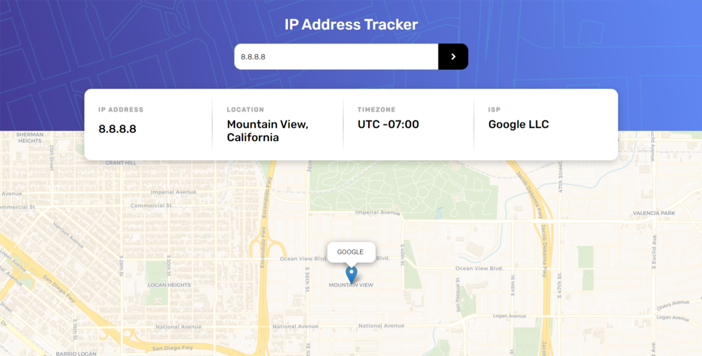
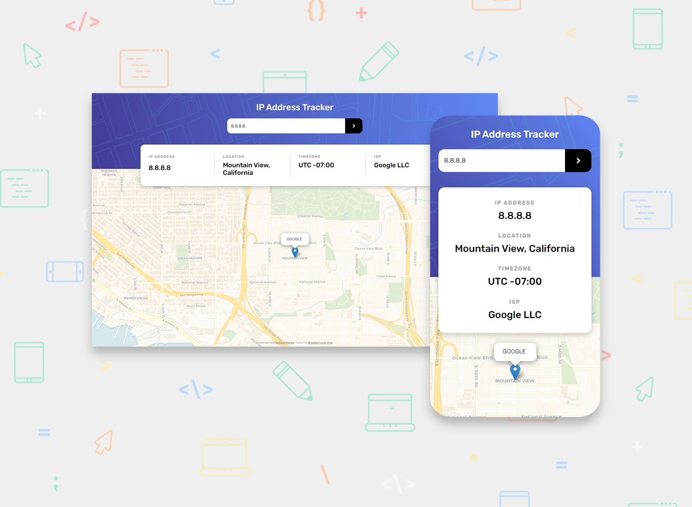

<h1 align="center">IP Address Tracker (ReactJS)</h1>

[Live](https://blc7896530-fem-ip-tracker.netlify.app/)
| [Solution]()
| [Challenge](https://www.frontendmentor.io/challenges/ip-address-tracker-I8-0yYAH0/hub)

Solution for a challenge from [frontendmentor.io](https://www.frontendmentor.io/)

## The challenge

Users should be able to:

- View the optimal layout for each page depending on their device's screen size
- See hover states for all interactive elements on the page
- See their own IP address on the map on the initial page load
- Search for any IP addresses (IPv4) and see the key information and location

## Screenshots

## Built with

- [React](https://reactjs.org/) - JS library
- [MUI](https://mui.com/) - React Library
- Semantic HTML5 markup
- CSS custom properties
- [IPify](https://geo.ipify.org/) - API utilized for geolocation

## Author

- GitHub - https://github.com/brandonlouis
- Frontend Mentor - [@brandonlouis](https://www.frontendmentor.io/profile/brandonlouis)
- LinkedIn - [Brandon Louis Chia](www.linkedin.com/in/brandon-louis-chia-63730b162)
