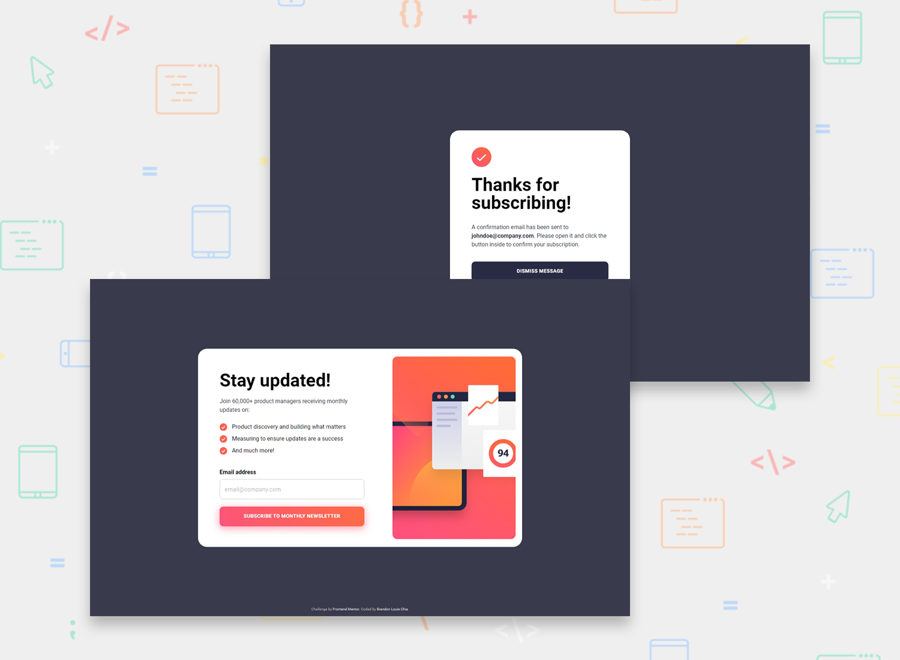

# Newsletter sign-up form with success message (ReactJS)

This is a solution to the [Newsletter sign-up form with success message challenge on Frontend Mentor](https://www.frontendmentor.io/challenges/newsletter-signup-form-with-success-message-3FC1AZbNrv).

## Table of contents

- [Overview](#overview)
  - [The challenge](#the-challenge)
  - [Screenshots](#screenshots)
  - [Links](#links)
- [My process](#my-process)
  - [Built with](#built-with)
- [Author](#author)

## Overview

### The challenge

Users should be able to:

- Add their email and submit the form
- See a success message with their email after successfully submitting the form
- See form validation messages if:
  - The field is left empty
  - The email address is not formatted correctly
- View the optimal layout for the interface depending on their device's screen size
- See hover and focus states for all interactive elements on the page

### Screenshots

### Links

- Solution URL: [https://www.frontendmentor.io/solutions/complete-solution-using-reactjs](https://www.frontendmentor.io/solutions/complete-solution-using-reactjs-Jj7HkAlsRe)
- Live Site URL: https://blc7896530-fem-newsletter.netlify.app/

## My process

### Built with

- [React](https://reactjs.org/) - JS library
- [MUI](https://mui.com/) - React Library
- Semantic HTML5 markup
- CSS custom properties

## Author

- GitHub - https://github.com/brandonlouis
- Frontend Mentor - [@brandonlouis](https://www.frontendmentor.io/profile/brandonlouis)
- LinkedIn - [Brandon Louis Chia](www.linkedin.com/in/brandon-louis-chia-63730b162)
