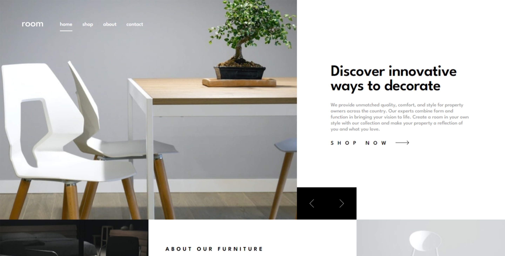
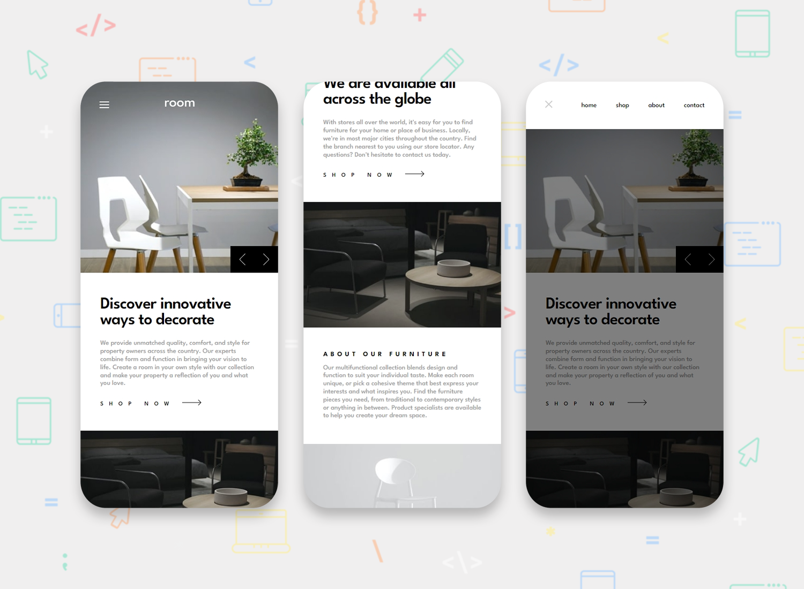

<h1 align="center">Room Homepage (ReactJS)</h1>

[Live](https://blc7896530-fem-room.netlify.app/)
| [Solution](https://www.frontendmentor.io/solutions/responsive-room-homepage-using-reactjs-Ko1mccaGPQ)
| [Challenge](https://www.frontendmentor.io/challenges/room-homepage-BtdBY_ENq)

Solution for a challenge from [frontendmentor.io](https://www.frontendmentor.io/)

## The challenge

Users should be able to:

- View the optimal layout for the site depending on their device's screen size
- See hover states for all interactive elements on the page
- Navigate the slider using either their mouse/trackpad or keyboard

## Screenshots

## Built with

- [React](https://reactjs.org/) - JS library
- [Material UI](https://mui.com/) - React Library
- Semantic HTML5 markup
- CSS custom properties

## Author

- GitHub - https://github.com/brandonlouis
- Frontend Mentor - [@brandonlouis](https://www.frontendmentor.io/profile/brandonlouis)
- LinkedIn - [Brandon Louis Chia](www.linkedin.com/in/brandon-louis-chia-63730b162)
