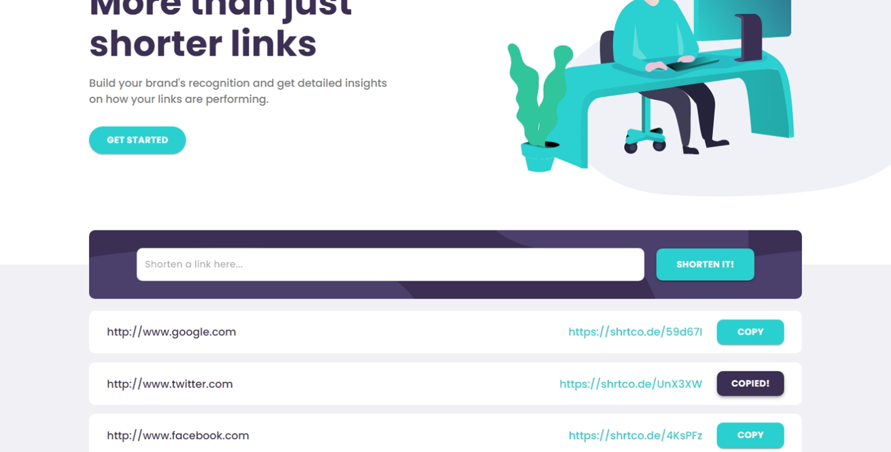
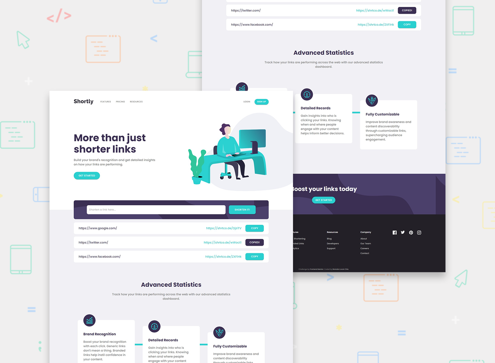
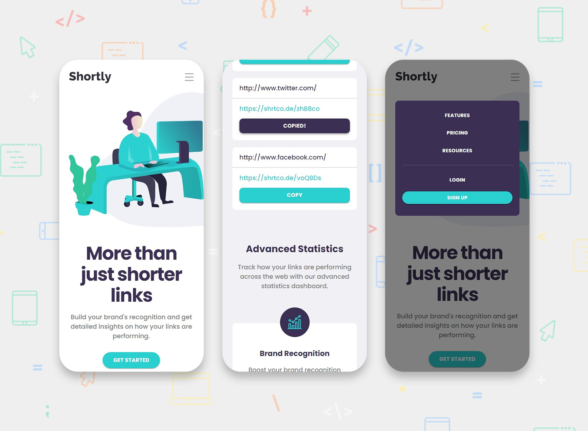

<h1 align="center">Shortly URL Shortening API (ReactJS)</h1>

[Live](https://blc7896530-fem-shortly.netlify.app/)
| [Solution](https://www.frontendmentor.io/solutions/shortly-url-shortening-api-using-reactjs-html-css-p8HYMdgBEv)
| [Challenge](https://www.frontendmentor.io/challenges/url-shortening-api-landing-page-2ce3ob-G)

Solution for a challenge from [frontendmentor.io](https://www.frontendmentor.io/)

## The challenge

Users should be able to:

- View the optimal layout for the site depending on their device's screen size
- Shorten any valid URL
- See a list of their shortened links, even after refreshing the browser
- Copy the shortened link to their clipboard in a single click
- Receive an error message when the `form` is submitted if:
  - The `input` field is empty

## Screenshots

## Built with

- [React](https://reactjs.org/) - JS library
- [MUI](https://mui.com/) - React Library
- Semantic HTML5 markup
- CSS custom properties
- [shrtcode](https://shrtco.de/) - API utilized for shortening of URLs

## Author

- GitHub - https://github.com/brandonlouis
- Frontend Mentor - [@brandonlouis](https://www.frontendmentor.io/profile/brandonlouis)
- LinkedIn - [Brandon Louis Chia](www.linkedin.com/in/brandon-louis-chia-63730b162)
