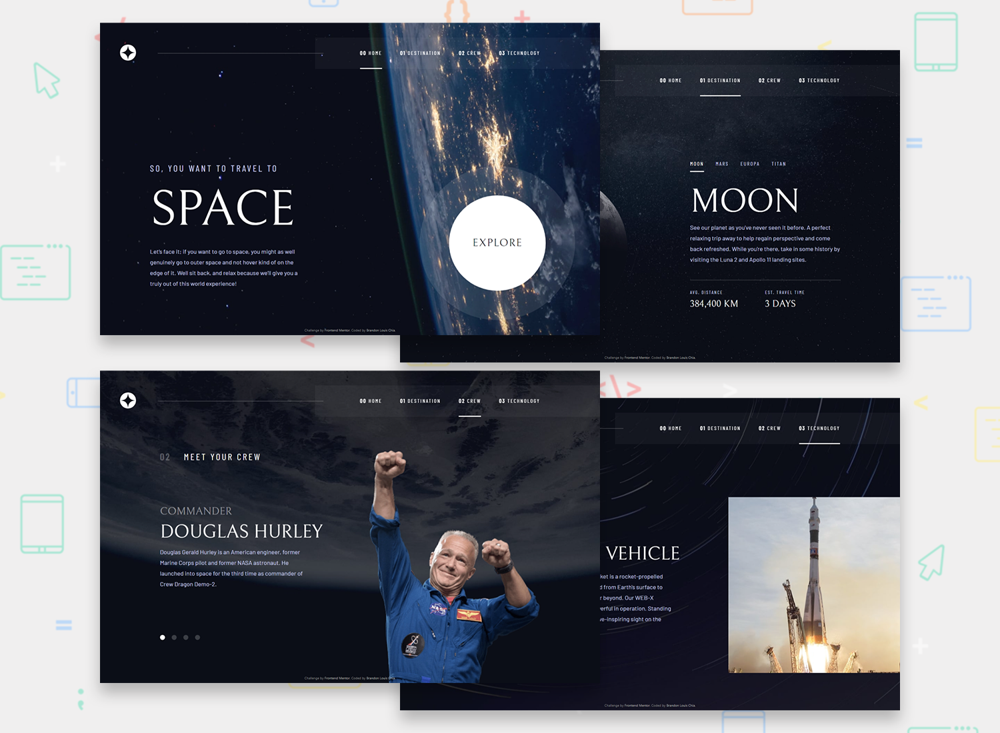
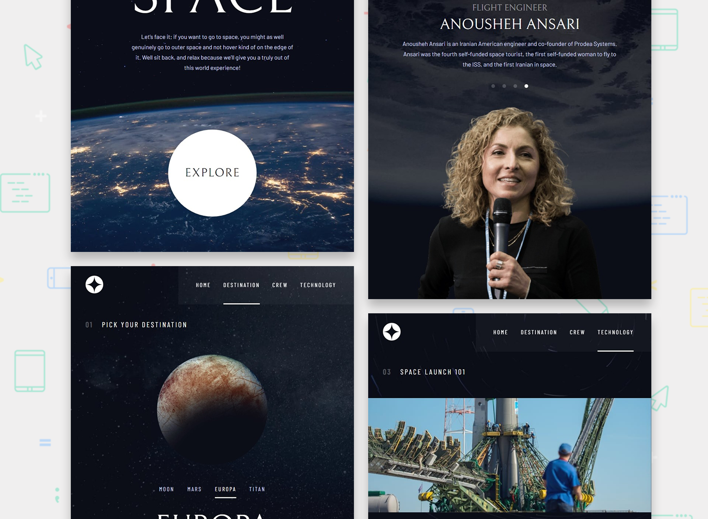
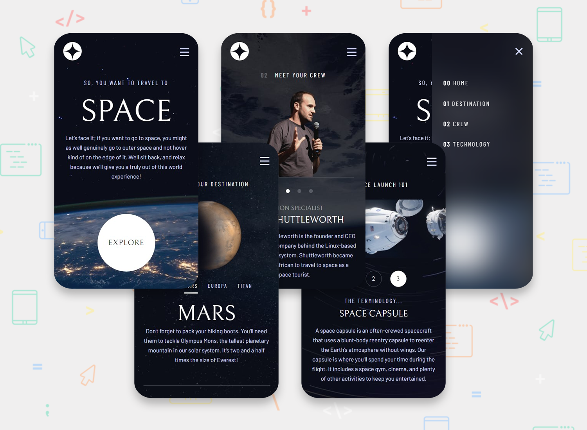

# Shortly URL shortening API (ReactJS)

This is a solution to the [Space tourism website challenge on Frontend Mentor](https://www.frontendmentor.io/challenges/space-tourism-multipage-website-gRWj1URZ3).

## Table of contents

- [Overview](#overview)
  - [The challenge](#the-challenge)
  - [Screenshots](#screenshots)
  - [Links](#links)
- [My process](#my-process)
  - [Built with](#built-with)
- [Author](#author)

## Overview

### The challenge

Users should be able to:

- View the optimal layout for each of the website's pages depending on their device's screen size
- See hover states for all interactive elements on the page
- View each page and be able to toggle between the tabs to see new information

### Screenshots

### Links

- Solution URL: [https://www.frontendmentor.io/solutions/space-tourism-multipage-website-using-reactjs](https://www.frontendmentor.io/solutions/responsive-space-tourism-multipage-website-using-reactjs-LL04XRzNU0)
- Live Site URL: [https://blc7896530-fem-space.netlify.app/](https://blc7896530-fem-space.netlify.app/)

## My process

### Built with

- [React](https://reactjs.org/) - JS library
- [MUI](https://mui.com/) - React Library
- Semantic HTML5 markup
- CSS custom properties

## Author

- GitHub - https://github.com/brandonlouis
- Frontend Mentor - [@brandonlouis](https://www.frontendmentor.io/profile/brandonlouis)
- LinkedIn - [Brandon Louis Chia](www.linkedin.com/in/brandon-louis-chia-63730b162)
